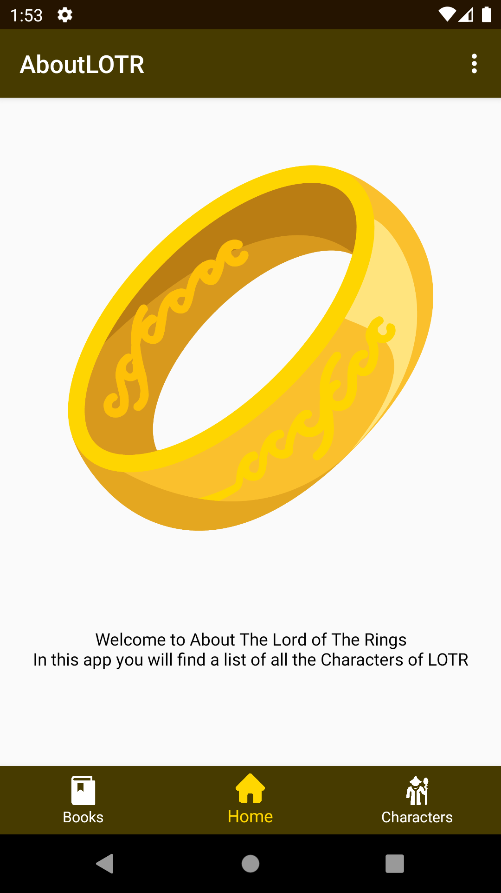
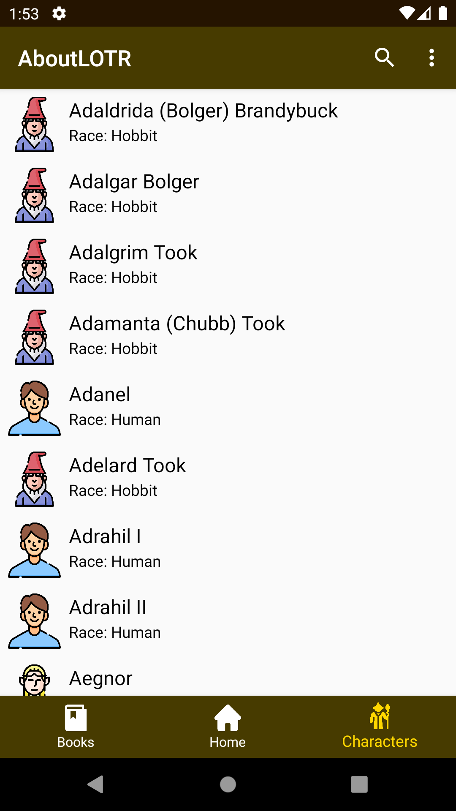
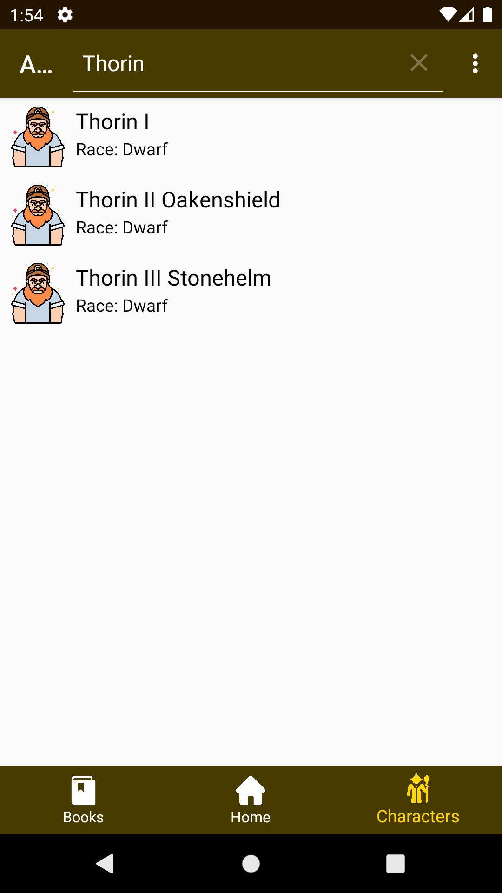
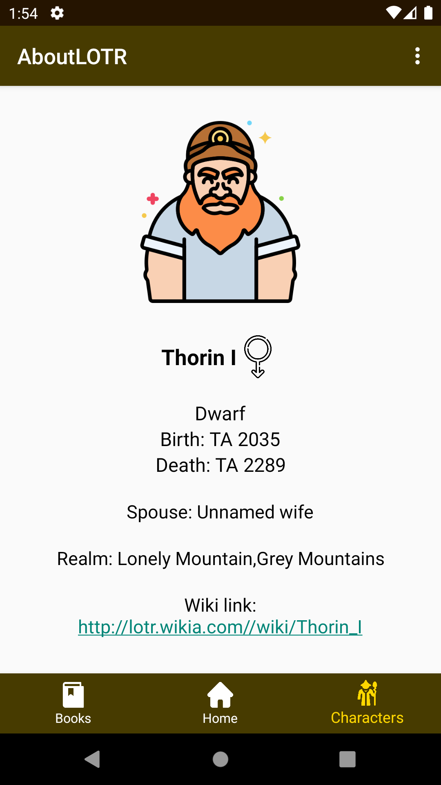

# AboutLOTR
An android app about The Lord of The Rings

## Présentation
AboutLOTR est une application ou vous pourrez visualiser une liste des personnages de The Lord of The Rings. Les données de cette appli viennent de l'API "The LOTR API".

## Récupération du projet
```
https://github.com/TheBlueSheepy/AboutLOTR.git
```
Ou bien l'apk :
```
app-debug.apk
```

## Points clef
- RecyclerView et detail d'un item de la liste
- 1 activité, 4 fragment
- Rest API
- Architecture :
  - Clean architecture
  - MVP
  - Singleton
- Fonction de recherche dans la liste des personnages

## Fonctionalités

### Accueil

- Ecran d'ouverture de l'application



### Liste des personnages

- Liste des personnages



### Recherche dans la liste

- Recherche dans la liste de personnages



### Detail personnage

- Detail du personnage cliquer sur la liste


