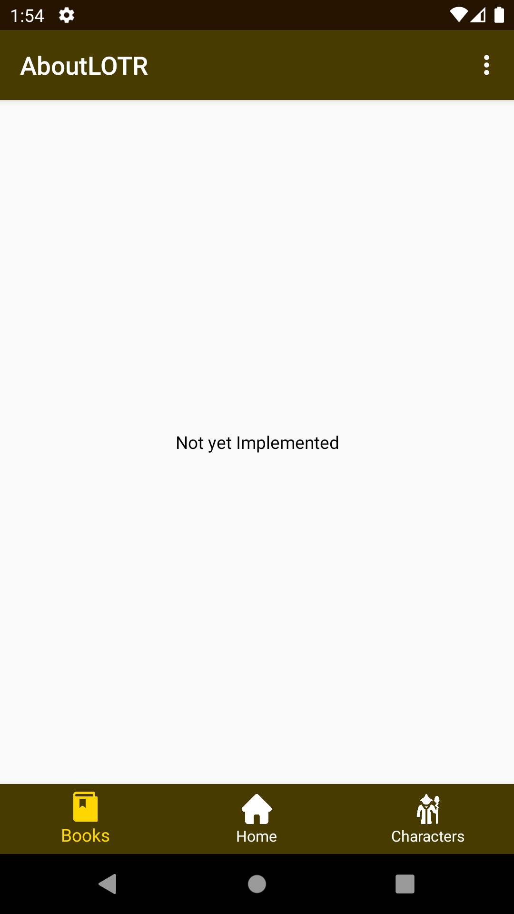

## [EDIT]
3rd year Android engineering school project.

# AboutLOTR
An android app about The Lord of The Rings

## Présentation
AboutLOTR est une application ou vous pourrez visualiser une liste des personnages de The Lord of The Rings. Les données de cette application viennent de l'API "<a href="https://the-one-api.herokuapp.com/">The LOTR API</a>".

## Récupération du projet
```
https://github.com/TheBlueSheepy/AboutLOTR.git
```
Ou bien l'apk :
```
app-debug.apk
```

## Points clef
- RecyclerView et détail d'un item de la liste
- 1 activité, 4 fragments
- Rest API
- Architecture :
  - Clean architecture
  - MVP
  - Singleton
- Fonction de recherche dans la liste des personnages

## Fonctionalités
### Accueil
- Ecran d'ouverture de l'application


### Liste des personnages
- Liste des personnages


- Recherche dans la liste de personnages


### Detail personnage
- Detail du personnage cliquer sur la liste

Possibilité de cliquer sur le lien wiki quand présent sur la fiche personnage.


## Amélioration
- Système de filtre sur la race des personnages
- Système de favoris
- Ajout de la liste des livres (pour l'instant fragment vide)



- "Settings" pour la langue de l'application a rajouter
